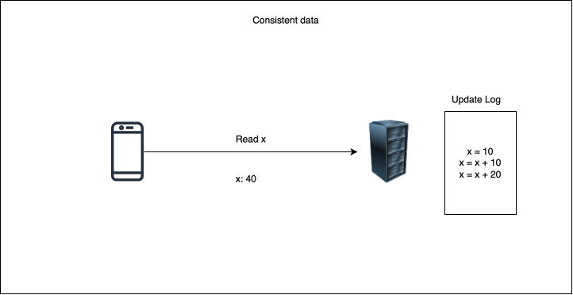
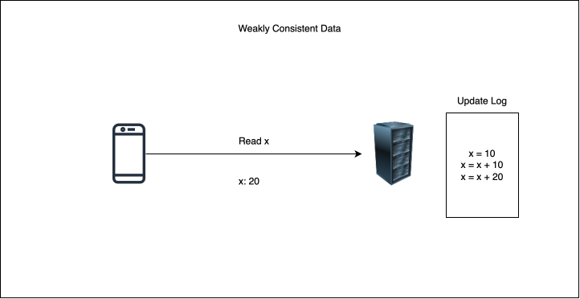

# What is Data Consistency?
It is a measure of how up to date a data is in a distributed system.

# Linearizable Consistency

# Eventual Consistency

# Causal Consistency

# Quorum

# Data Consistency Levels tradeoffs

# Transaction Isolation Levels

# Read Committed

# Repeatable Reads

# Serializable Isolation level

# Transaction Level Implementation

# Conclusion - Transaction Isolation